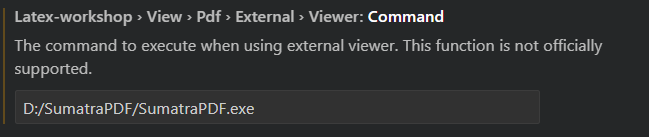

# <center>Latex文档书写指南

### 环境搭建
1. 安装vscode和必要插件
    - 安装[vscode](https://code.visualstudio.com/)
    - 安装LaTeX Workshop插件
2. 安装[Latex编译器](https://blog.csdn.net/Nicolecocol/article/details/136968456)
   - 安装[Texlive](https://mirrors.tuna.tsinghua.edu.cn/CTAN/systems/texlive/Images/)(文件很大，下载安装过程大概需要一两个小时)
   - 添加系统环境变量
3. 配置VSCode和LaTeX Workshop插件

### 配方文件
```c
"latex-workshop.latex.tools": [
        {
            "name": "pdflatex",
            "command": "pdflatex",
            "args": [
              "-synctex=1",
              "-interaction=nonstopmode",
              "%DOC%"
            ]
          },
          
          {
            "name": "xelatex",
            "command": "xelatex",
            "args": [
              "-synctex=1",
              "-interaction=nonstopmode",
              "%DOC%"
            ]
          },

        ],


    "latex-workshop.latex.recipes": [
        {
            "name": "xelatex",
            "tools": ["xelatex"]
        },
        {
            "name": "latexmk",
            "tools": ["latexmk"]
        },
        {
            "name": "pdflatex -> bibtex",
            "tools": ["pdflatex","bibtex"]
        },

        {
             "name": "pdflatex -> bibtex -> pdflatex*2",
             "tools": [
                 "pdflatex",
                 "bibtex",
                 "pdflatex",
                 "pdflatex"
             ]
        },

        {
            "name": "xelatex -> bibtex -> xelatex*2",
            "tools": [
            "xelatex",
            "bibtex",
            "xelatex",
            "xelatex"
            ]

        }
    ],

    "latex-workshop.synctex.afterBuild.enabled": true,
    "latex-workshop.view.pdf.viewer": "tab",//设置编译完成后的pdf显示方式
    "latex-workshop.view.pdf.external.viewer.command": "D:/SumatraPDF/SumatraPDF.exe",
    "latex-workshop.view.pdf.external.synctex.command": "D:/SumatraPDF/SumatraPDF.exe",
    "latex-workshop.view.pdf.external.synctex.args": [
        "-forward-search",
        "%TEX%",
        "%LINE%",
        "-reuse-instance",
        "-inverse-search",
        "\"D:/VScode/Microsoft VS Code/Code.exe\" -g\"%f:%l\"",
        "%PDF%"
    ],

    "latex-workshop.view.pdf.internal.synctex.keybinding": "double-click",
     //取消编译出错时的烦人气泡
    "latex-workshop.message.error.show": false,
    "latex-workshop.message.warning.show": false,

    "latex-workshop.intellisense.type": "basic",

    "latex-workshop.latex.clean.enabled": true, // 启用清理功能

    "latex-workshop.showContextMenu": true, //添加LaTex Workshop右键菜单。
    "latex-workshop.intellisense.package.enabled": true, //根据加载的包，自动完成命令或包。  
    
    "latex-workshop.latex.autoBuild.run": "onSave",
    "cSpell.userWords": [
        "autofetch",
        "biber",
        "bibtex",
        "DOCFILE",
        "latexmk",
        "nonstopmode",
        "pandoc",
        "pdflatex",
        "synctex",
        "xelatex"
    ],
    "latex-utilities.countWord.path": "D:\\Latex\\texlive\\2024\\bin\\windows\\texcount.exe",
    "latex-utilities.countWord.format": "${words} Words",

```


### 编译优化
1. 中间文件的清理
   - 在设置中，启用**latex-workshop.latex.autoClean.run**选项，使编译后自动删除中间文件。
        ```c
          "latex-workshop.latex.autoClean.run":"onBuilt"            
        ```
   - 确保**latex-workshop.latex.clean.method**已设置为**glob**
        ```c
        "latex-workshop.latex.clean.method":"glob"
        ```  
   - **latex-workshop.latex.clean.fileTypes**属性定义清理文件的模式数组
      ```c
        //设置在编译完成后所需要删除的文件格式
        "latex-workshop.latex.clean.fileTypes": [
            "*.aux",
            "*.bbl",
            "*.blg",
            "*.idx",
            "*.ind",
            "*.lof",
            "*.lot",
            "*.out",
            "*.toc",
            "*.acn",
            "*.acr",
            "*.alg",
            "*.glg",
            "*.glo",
            "*.gls",
            "*.ist",
            "*.fls",
            "*.log",
            "*.fdb_latexmk",
            "*.synctex.gz"
        ],
      ```
  

### 导出PDF文件
1. 下载PDF阅读器
    - 安装[SumatraPDF](https://www.sumatrapdfreader.org/downloadafter)
2. Latex workshop配置
   - 将配置latex-workshop.view.pdf.viewer为tab，路径修改为SumatraPDF的安装路径
   

### 参考教程
1. B站：
   - [1](【Win10+VSCode+Texlive+SumatraPDF搭建Latex环境】https://www.bilibili.com/video/BV1ht4y197Nz?vd_source=1e77d1a1c772c8ff7d3f0ecf0d3eebf6)


2. CSDN
   - [1](https://blog.csdn.net/Ruins_LEE/article/details/123555016)
   - [2](https://blog.csdn.net/qq_42706589/article/details/122300673)
   - [3](https://blog.csdn.net/qq_41554005/article/details/120712126)

### 常见问题集锦
1. 导出PDF出错
   - PDF路径配置错误
2. 编译后无反应
   - 检查语法错误 