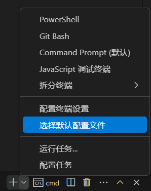
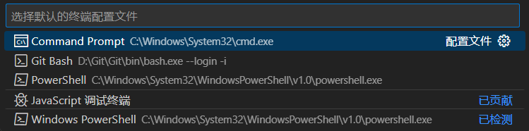
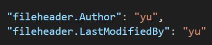

# <center> Vscode及相关环境配置 </center>
## 目录
- [ Vscode及相关环境配置 ](#-vscode及相关环境配置-)
  - [目录](#目录)
    - [基本语言](#基本语言)
      - [C语言](#c语言)
      - [Python](#python)
      - [C++](#c)
    - [文档书写](#文档书写)
      - [Markdown](#markdown)
      - [Latex](#latex)
    - [嵌入式](#嵌入式)
      - [Keil](#keil)
      - [Git](#git)
      - [STM32Cube](#stm32cube)
        - [STM32CubeIDE](#stm32cubeide)
          - [1. 安装必要的工具和扩展](#1-安装必要的工具和扩展)
          - [2. 配置C/C++工具链](#2-配置cc工具链)
          - [3. 配置VSCode项目](#3-配置vscode项目)
          - [4. 导入STM32CubeIDE项目](#4-导入stm32cubeide项目)
          - [5. 编译和调试](#5-编译和调试)
        - [STM32CubeCLT](#stm32cubeclt)
      - [Arduino](#arduino)


### 基本语言
#### C语言
1. 安装扩展包(c/c++)
2. 下载C语言编译器[Mingw](https://sourceforge.net/projects/mingw-w64/files/mingw-w64/mingw-w64-release/)
3. 将编译器添加到系统环境变量

#### Python
1. 安装扩展包(python)
2. 下载[Python](https://www.python.org/)的编译环境

#### C++

### 文档书写
#### Markdown
1. 安装扩展（Markdown All in One 和 Markdown Preview Enhanced/Markdown PDF）
2. 想要将Markdown的文件导出为PDF文件，则需要安装chrome，并将path添加到扩展设置，注意路径末尾要加上 **\\chrome.exe**

#### Latex
1. 安装[Texlive](https://tug.org/texlive/)（时间非常漫长） 这是一个国内的镜像网站，进去后点击on DVD->Download iso
2. 安装扩展包（Latex Workshop 和 Latex Uyilities）
3. 配置.json文件
4. 一定要在Latex Utilities的Path中添加TeXCount.exe的安装路径，否则会报错TeXCount failed. Please refer to LaTeX Utilities Output for details.
5. 关于语言包，注意文件夹是否为只读文件夹，需要以管理员身份运行下载更新语言包

### 嵌入式
#### Keil
1. 安装[Keil](https://www.keil.com/)
2. 安装扩展包(Keil Assistant)
3. 配置Keil,在Keil中找到tools->custimuze tools-import,找到vscode的安装路径即可
4. 配置Vscode,在扩展中将Keil的配置文件UV4添加到path中

    

#### Git
1. 安装[Git](https://git-scm.com/)，注意要选择在Vscode中开发，其余选项一直点next即可
2. 桌面右击open git bash here,在给git中配置Github用户名和邮箱
<br>`git-config --global user.name "yourname"`
<br>`git-config --global user.email "your email"` 

3. 配置Vscode,在扩展中将Git的配置文件Git Bash添加到path中(未进行该操作)
4. 安装扩展(Git Graph 和 Git History)方便工程管理
5. 在GitHub上新建仓库，再克隆就可以使用啦


#### STM32Cube
##### STM32CubeIDE
在VSCode中配置STM32CubeIDE的环境可以通过以下步骤实现。由于STM32CubeIDE是一个集成的开发环境，并且包含了许多特定的工具链和配置，设置VSCode需要一些手动步骤来确保所有工具正确配置和工作。以下是详细步骤：

###### 1. 安装必要的工具和扩展
首先，你需要安装以下VSCode扩展：
- **C/C++**（由Microsoft提供）
- **Cortex-Debug**（由Marus提供）
- **Arm None Eabi GCC**（[ARM官方网站](https://developer.arm.com/tools-and-software/open-source-software/developer-tools/gnu-toolchain/gnu-rm)下载）
>- Arm GNU Toolchain 和 Arm None Eabi GCC 实际上是相关的术语，但在某些上下文中可能有不同的使用方式。让我们仔细看看它们的定义和关系：
>    1. Arm GNU Toolchain>
Arm GNU Toolchain 是 ARM 公司提供的一套完整的开发工具链，包括编译器（GCC）、汇编器、连接器和调试器等。它基于 GNU 工具链，并针对 ARM 处理器进行了优化和扩展。工具链的主要组件包括： 
GCC (GNU Compiler Collection): 编译器前端和后端，用于将 C/C++ 源代码编译成机器码。
binutils: 二进制工具，包括汇编器、连接器等。
GDB (GNU Debugger): 调试器。
Newlib: C 标准库的轻量级实现。
>    2. Arm None Eabi GCC
Arm None Eabi GCC 是 Arm GNU Toolchain 中的编译器部分，它专门用于嵌入式开发中的 ARM 目标。none 指的是没有操作系统的裸机环境，eabi 代表嵌入式应用二进制接口 (Embedded Application Binary Interface)，这是一种 ABI 规范，用于确保二进制代码的兼容性。
> - 总结:
Arm GNU Toolchain 是一个完整的工具链集合，包含编译器、汇编器、连接器、调试器等工具。
Arm None Eabi GCC 是工具链中的编译器部分，专门用于生成符合嵌入式应用二进制接口 (EABI) 的代码，适用于没有操作系统的裸机环境。
安装和配置
通常，你可以从 ARM 的官方网站或其他可靠的源下载并安装 Arm GNU Toolchain，其中包含 arm-none-eabi-gcc, 在VSCode中，你需要将这个路径添加到系统环境变量中，以便VSCode可以找到编译器。

***tips***:
1. 推荐安装STM32CubeIDE，它提供了完整的STM32开发环境，包括编译器、调试器、工程管理器等，不需要再单独安装ARM GCC工具链以及OpenOCD（Open On-Chip Debugger--用于调试和编程的开源工具）
2. vscode 安装STM32 VS Code Extension扩展
3. 推荐下载STM32CubeCLT，STM32 VS Code Extension扩展2.0.0版本不再支持导入STM32CubeIDE项目
> - 找到STM32CubeIDE的工具链路径,通常情况下，STM32CubeIDE会安装ARM GCC工具链到类似如下的路径：<br>
Windows:C:\ST\STM32CubeIDE_version\STM32CubeIDE\plugins\com.st.stm32cube.ide.mcu.externaltools.gnu-tools-for-stm32_version\tools\bin<br>
将该路径添加到你的系统环境变量中，或者直接在VSCode配置文件中引用该路径。
> - 找到STM32CubeIDE的调试工具,STM32CubeIDE自带了一些调试工具，如ST-LINK Server。你需要找到这些工具的路径。通常，它们位于STM32CubeIDE的安装目录下，例如：<br>
Windows:C:\ST\STM32CubeIDE_version\STM32CubeIDE\plugins\com.st.stm32cube.ide.mcu.externaltools.stlink-gdb-server_version\tools\bin

###### 2. 配置C/C++工具链
确保你的系统已经安装了ARM GCC工具链,添加工具链路径到系统环境变量：
- Windows:
  1. 打开“环境变量”设置。
  2. 在“系统变量”中找到`Path`，并添加工具链的bin目录路径，例如`C:\Program Files (x86)\GNU Arm Embedded Toolchain\10 2020-q4-major\bin`。
- macOS和Linux:
  1. 打开终端。
  2. 编辑`~/.bashrc`或`~/.zshrc`文件，添加以下行：
     ```sh
     export PATH=$PATH:/path/to/your/arm-none-eabi-gcc/bin
     ```
  3. 保存文件并运行`source ~/.bashrc`或`source ~/.zshrc`。

###### 3. 配置VSCode项目
1. **创建VSCode工作区**：在你的STM32项目目录中，创建一个`.vscode`文件夹，并在其中创建以下配置文件：
   
   - `c_cpp_properties.json`：
     ```json
     {
       "configurations": [
         {
           "name": "STM32",
           "includePath": [
             "${workspaceFolder}/**",
             "/path/to/STM32CubeIDE/STM32Cube_FW_F4_V1.24.0/Drivers/**"
           ],
           "defines": [
             "STM32F401xE",
             "USE_HAL_DRIVER"
           ],
           "compilerPath": "/path/to/arm-none-eabi-gcc/bin/arm-none-eabi-gcc",
           "cStandard": "c11",
           "cppStandard": "c++14",
           "intelliSenseMode": "gcc-arm"
         }
       ],
       "version": 4
     }
     ```
   - `launch.json`（用于调试配置）：
     ```json
     {
       "version": "0.2.0",
       "configurations": [
         {
           "name": "Cortex Debug",
           "type": "cortex-debug",
           "request": "launch",
           "servertype": "stlink",
           "cwd": "${workspaceFolder}",
           "executable": "${workspaceFolder}/build/your_project.elf",
           "device": "STM32F401RE",
           "configFiles": [
             "interface/stlink.cfg",
             "target/stm32f4x.cfg"
           ]
         }
       ]
     }
     ```

   - `tasks.json`（用于构建配置）：
     ```json
     {
       "version": "2.0.0",
       "tasks": [
         {
           "label": "build",
           "type": "shell",
           "command": "make",
           "args": [],
           "group": {
             "kind": "build",
             "isDefault": true
           },
           "problemMatcher": [
             "$gcc"
           ],
           "detail": "Generated task by STM32CubeIDE"
         }
       ]
     }
     ```

2. **配置调试适配器**：确保你已经安装了ST-Link工具，并且配置正确的调试适配器路径。例如，安装[ST-Link的驱动程序](https://www.st.com/en/development-tools/stsw-link009.html)并将其添加到系统路径。

###### 4. 导入STM32CubeIDE项目
如果你已经有一个STM32CubeIDE项目，可以将其导入VSCode中：
1. 打开VSCode。
2. 选择“文件”->“打开文件夹”，然后选择你的STM32CubeIDE项目根目录。
3. VSCode会自动识别`.project`和`.cproject`文件，并将其导入。

###### 5. 编译和调试
1. **编译**：在VSCode中，打开命令面板（Ctrl+Shift+P），输入“Tasks: Run Build Task”并选择你配置的`build`任务。
2. **调试**：确保你的ST-Link已连接到开发板。在调试面板中，选择“Cortex Debug”配置并点击开始调试按钮。

##### STM32CubeCLT
1. 下载[STM32CubeCLT](https://www.st.com/en/development-tools/stm32cubeclt.html#tools-software)和[STM32CubeMX](https://www.st.com/content/st_com/en/stm32cubemx.html#st-get-software)
2. 下载vscode扩展：**STM32 VS Code Extension**，添加路径
  
3. 添加所有环境变量(CMake编译器,工具链和STLink GDB),这一套流程都由STM32CubeCLT下载配置好高度集成<br>
  

>CMake 的本质是一个构建系统生成器，它通过解析项目中的配置文件（主要是 CMakeLists.txt 文件），生成适合目标平台的本地构建文件，如 Makefile、Visual Studio 项目文件等。这一过程的核心目的是使软件的构建过程跨平台、灵活和易于管理。<br>        
>- CMake 的工作原理<br>
> CMake 的工作流程可以分为以下几个步骤：<br>
     1. 解析配置文件：
       CMake 通过解析 CMakeLists.txt 文件来获取项目的配置信息。这个文件包含了项目的基本信息（如名称、版本）、源文件列表、依赖关系、编译选项等。<br>
     2. 配置检查：
       在解析过程中，CMake 会进行一系列配置检查，如检查编译器的可用性、查找所需的库和头文件等。这些检查结果会存储在缓存文件（如 CMakeCache.txt）中。<br>
     3. 生成构建文件：
       根据解析和检查的结果，CMake 生成适用于当前平台和编译器的构建文件。例如，在 Linux 系统上，CMake 可能生成 Makefile 文件；在 Windows 系统上，CMake 可能生成 Visual Studio 项目文件。<br>
     4. 构建项目：
       用户使用生成的构建文件，通过相应的构建工具（如 make、Visual Studio）进行项目的编译和链接，生成最终的可执行文件或库。<br>
> - CMake 的核心概念<br>
    1. 配置文件（CMakeLists.txt）：这是 CMake 的主要输入文件，包含了项目的配置信息和构建规则。<br>
    2. 生成器（Generator）：CMake 支持多种生成器，每种生成器对应一种构建系统，如 Unix Makefiles、Ninja、Visual Studio 项目文件等。用户可以通过命令行选项指定生成器。<br>
    3. 缓存文件（CMakeCache.txt）：这个文件用于存储配置检查的结果和一些用户指定的变量值，便于后续的配置和构建过程。<br>
    4. 命令和模块：CMake 提供了丰富的内置命令和模块，用于实现各种配置和构建需求，用户也可以编写自定义模块来扩展 CMake 的功能。

4. 在STM32CubeMX中新建工程，打开文件夹并在**STM32 VS Code Extension**扩展中导入工程,然后就可以开始开发啦


#### Arduino
1. 安装[Arduino IDE](https://www.arduino.cc/)
2. 下载Arduino扩展，并配置扩展
     - 添加Arduino的安装路径
     - 取消勾选<br>  
3. 打开一个Arduino工程文件夹，右上角验证后会报错，接下来需要选择自己的开发板型号并下载相关资源即可,之后再次验证即可
4. 配置.json文件，加快二次编译速率  
     - 添加以下内容到.json文件中<br>
5. 选择正确的串口，下载程序即可